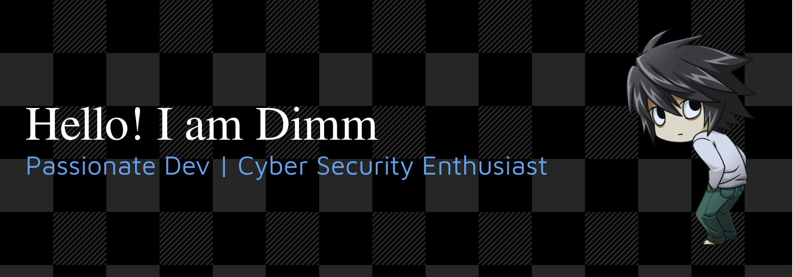

---

### 🛡️ Passionate about **Cyber Security & Ethical Hacking**

### 💻 Building **Secure & Scalable Web Applications**

---

### 🎓 Member of

 &nbsp;&nbsp;
 &nbsp;&nbsp;

---

### 👨‍💻 About Me

-  **Cyber Security Enthusiast** — passionate about breaking and securing systems
-  **Passionate Developer** — crafting clean, efficient code
-  **Linux Enthusiast** — open-source believer
-  **KISS** — Keep It Simple, Stupid
-  Learning to **break systems** so I can **build them stronger**

---

### 🧠 Currently Focused On

- **Penetration Testing** & **Vulnerability Assessment**
- **Secure Application Development** following OWASP standards
- **Security Automation** & custom tooling
- **Full-Stack Web Development** with security-first approach

---

### 🔧 Dev Setup

- **OS:** Arch Linux + Hyprland, Windows 11
- **Editor:** Neovim (LazyVim), VS Code
- **Terminal:** Kitty + Oh My Zsh + Powerlevel10k
- **Security:** Burp Suite, Wireshark, Metasploit
- **Browser:** Tor, Firefox

---

### 🌐 Connect With Me

---

---

## 💻 Tech Stack

  
  
  
  
  
  
  
  
  
  
  
  
  
  
  
  
  
  
  
  
  
  
  
  
  
  
  
  
  

---

## 🛡️ Security Stack

---

---

## 📊 GitHub Stats

---

