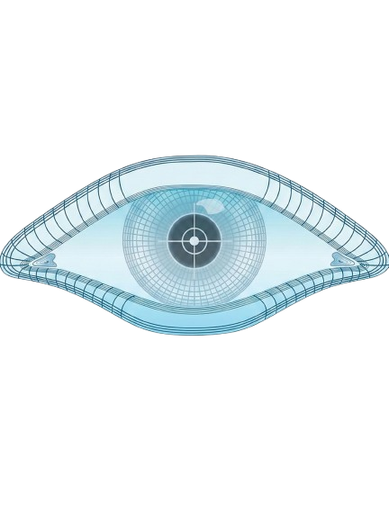
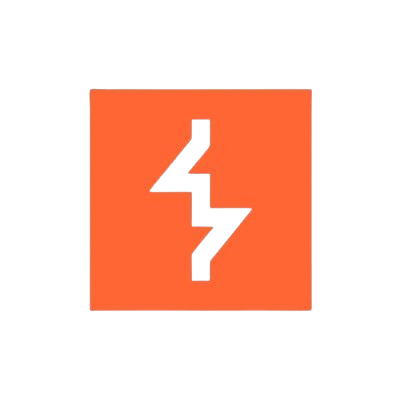

---

### 🛡️ Learning how real attackers break systems — to help defenders fix them
### 🕵️ Focused on learning Offensive Security & Exploitation
### 🎯 Seeking CTF Team / Pentesting Internship opportunities

---

### 👨‍💻 **About Me**

- **Offensive Security / Red Team enthusiast** with a strong interest in realistic adversary simulation
- Focused on learning **realistic attack techniques**, adversary simulation, and offensive tradecraft
- **Linux Enthusiast** — Open Source believer and daily Linux user
- Enjoys hands-on labs, CTFs, and security research to sharpen technical depth

### 🎯 **Goal in Cyber Security**

My goal is to pursue a career in **Offensive Security as a Red Team practitioner**, focusing on simulating realistic adversary behavior to help organizations identify and strengthen security weaknesses.

I am continuously developing my skills in **binary exploitation, advanced web exploitation, and red team tradecraft**, with an emphasis on realistic attack chains, post-exploitation workflows, and operational security (OPSEC).

I am also working toward obtaining **industry-recognized offensive security and red team certifications** to formally validate my hands-on technical and operational capabilities.

---

### 🧠 **Currently Learning**

- **Binary Exploitation:** Program analysis and debugging using **GDB** and **Ghidra**
- **Web Exploitation:** Web PWN, **IDOR**, **SQL Injection**, **SSRF**, **SSTI**, **Authentication & Authorization Bypass**
- **Active Directory Attacks:** AD enumeration, **Kerberos fundamentals**, **privilege escalation**, and common misconfigurations
- **Red Team Tradecraft:** Payload development fundamentals and **post-exploitation workflows**
- **OWASP Top 10:** **Injection**, **Broken Access Control**, **Authentication Failures**, **Security Misconfiguration**, **Insecure Deserialization**, **SSRF** (offensive-focused)

---

### 🎓 **Member Of & Badges:**

  

## 🛠️ **OFFENSIVE TOOLKIT**

### Languages (Offensive-Focused)

  
  &nbsp;&nbsp;
  
  &nbsp;&nbsp;
  
  &nbsp;&nbsp;
  
  &nbsp;&nbsp;
  

## ⚔️ Offensive Security Tools

  
  
  
  
  
  

---

---

