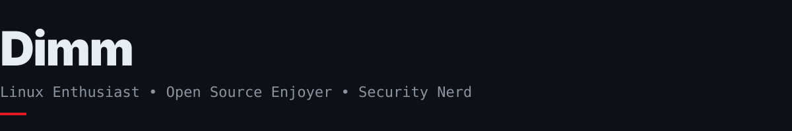

### About Me
I'm a **Linux enthusiast** and **Offensive Security student** who loves diving into hands-on labs, CTFs, and security research. I am highly interested in how real-world attacks happen, and I spend most of my free time learning about offensive tradecraft and adversary simulation.

### Goal in Cyber Security
My ultimate goal is to become a **Red Team practitioner**. Right now, I'm focused on learning how to execute realistic attack chains, understanding post-exploitation, and studying operational security (OPSEC). I'm currently working towards industry-recognized certifications to build my skills and break into the field.

### Currently Learning
- **Red Team Tradecraft:** Payload development, AV/EDR evasion, and advanced post-exploitation workflows.
- **Active Directory & Cloud:** AD enumeration, Kerberos attacks, and hybrid IAM privilege escalation (AWS/Azure/Entra ID).
- **Advanced Web & API:** Complex attack chains involving IDOR, SSRF, SSTI, and authentication bypass.
- **Binary Exploitation:** Low-level program analysis, reverse engineering, and debugging using GDB and Ghidra.
- **AI/LLM Security:** Exploring prompt injection and the OWASP LLM Top 10.

---

  

---

