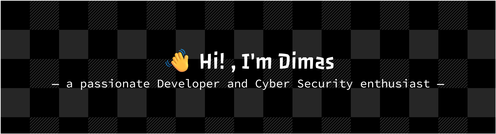

---

### 🛡️ **Breaking Systems to Build Them Stronger**
### 🕵️ **Focused on Offensive Security & Exploitation**
### 🎯 **Currently Seeking Red Team / Pentesting Internships**

---

### 👨‍💻 **About Me**

- **Offensive Security / Red Team enthusiast** with a strong interest in realistic adversary simulation
- Focused on learning **realistic attack techniques**, adversary simulation, and offensive tradecraft
- **Linux Enthusiast** — Open Source believer and daily Linux user
- Enjoys hands-on labs, CTFs, and security research to sharpen technical depth

### 🎯 **Goal in Cyber Security**

My goal is to pursue a career in **Offensive Security as a Red Team practitioner**, focusing on simulating realistic adversary behavior to help organizations identify and strengthen security weaknesses.  
I am continuously developing my skills in **binary exploitation, advanced web exploitation, and red team tradecraft**, with an emphasis on realistic attack chains, post-exploitation workflows, and operational security (OPSEC).

 I also working toward obtaining **industry-recognized offensive security and red team certifications** to formally validate my hands-on technical and operational capabilities.

---

### 🧠 **Currently Learning**

- **Binary Exploitation:** Deep dive into GDB and Ghidra.
- **Web Exploitation** Web PWN, IDOR, SQL Injection, SSRF, SSTI, Authentication & Authorization Bypass
- **Red Team Tradecraft:** Payload development and post-exploitation concepts
- **OWASP Top 10:** Injection, Broken Access Control, Authentication Failures, Security Misconfiguration, Insecure Deserialization, SSRF (offensive-focused).

---

### 🎓 **Member Of & Badges:**

---

## 🛠️ **OFFENSIVE TOOLKIT**

### ⚔️ Weapons (Languages)

  
  &nbsp;&nbsp;
  
  &nbsp;&nbsp;
  
  &nbsp;&nbsp;
  

---

### 🧰 Offensive Security Tools

  
  &nbsp;&nbsp;
  
  &nbsp;&nbsp;
  
  &nbsp;&nbsp;
  

---

---

